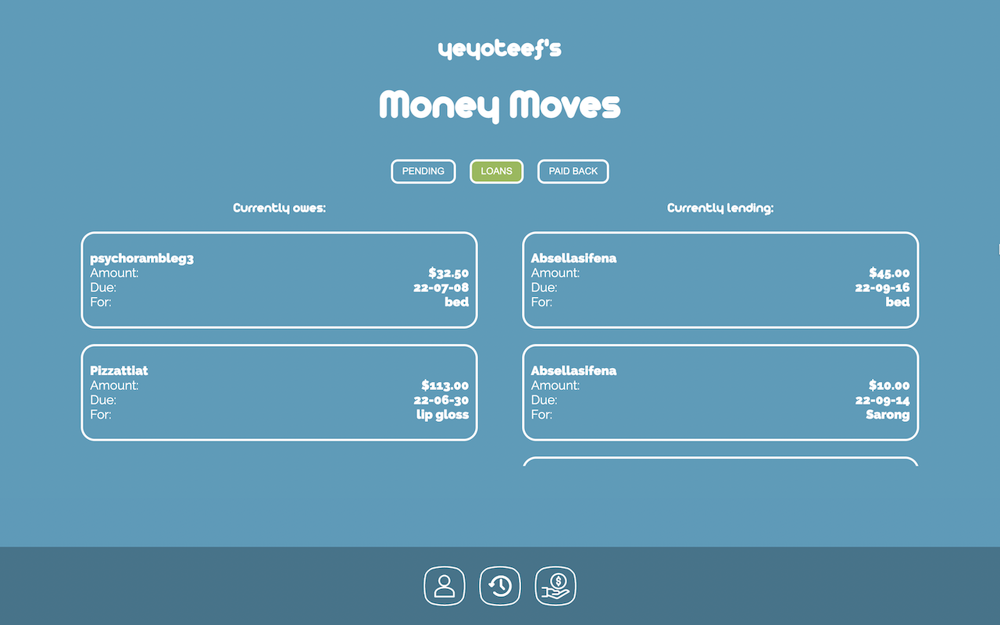
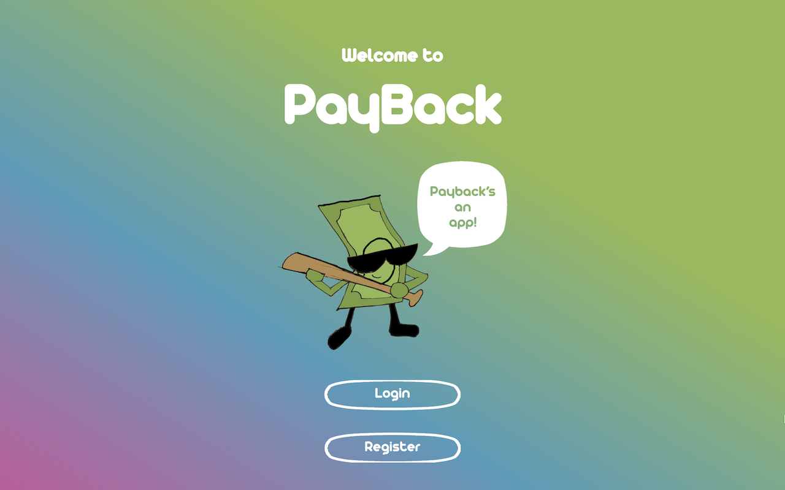

# samarthak APP

## Overview

Four day hackathon event hosted by Girl, Develop it! A team of eight was put together to solve the following problem:

- Sometimes lending money to friends and family members can cause some stress. Its always easy for someone we care about to simply "forget" to pay us back, generating a possible uncomfortable situation.

### The Goal

Deliver MVP with the following features:

- Login/Register
- Create Borrow Requests
- Have lender approve or deny the request
- Track that transaction
- Ability for the lender to mark a transaction as "paid"
- Ability for the lender to rate the borrower

### Screenshots

## Tech

### Built With

- Frontend
  - React.js with CRA TypeScript templated
- Backend
  - Node.js
  - Express
  - Jest
- DB
  - Postgres
- Tech
  - Discord
  - Slack
  - VS Code live-share extension
  - git/Github
- Management
  - Agile/SCRUM
  - Github Projects

### Running

#### Fork/Clone

- Fork/Clone project
- On the root, run `npm install` to install backend dependencies
- `cd client` and run `npm install` to install client dependencies
- Create .env file on the root and add: `TOKEN_SECRET=chooseStringWithoutQuotes`

#### DB Set up

> do once on local machine - from home directory

- (Mac) brew install postgresql
- brew services start postgresql
- psql postgres
- CREATE ROLE postgres WITH LOGIN PASSWORD 'postgres1';
- ALTER ROLE postgres CREATEDB;
- \q
- psql postgres -U postgres

> do every time re-setting database - from project directory

- cd server/database
- sh create.sh

#### Run development

- At the root, run `npm run dev` to start the API
- On a second terminal, `cd client` and `npm start`